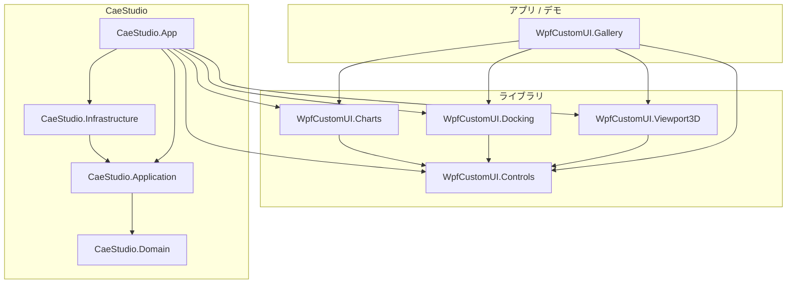

# WpfCustomUI

WPF 向けの **テーマ基盤 + CAE 向け UI コンポーネント** と、ドッグフーディング用サンプル **CaeStudio** のモノレポです。

- **ターゲット**: .NET 10 (`net10.0-windows` / 一部 `net10.0`) / Windows / WPF
- **配布**: 当面はプロジェクト参照。NuGet 化可能なメタデータは csproj 側に用意
- **ライセンス**: 未整備（私有リポジトリ前提。公開時に選定すること）

設計の詳細・フェーズ履歴は [`.dev/spec.md`](.dev/spec.md) を参照してください。本 README 群は入口と地図に留めます。

## 前提

- [.NET 10 SDK](https://dotnet.microsoft.com/download)
- Windows（WPF / D3D ビューポートのため）

## ソリューション

```text
WpfCustomUI.slnx
```

```bash
dotnet build WpfCustomUI.slnx -c Debug
dotnet test  WpfCustomUI.slnx -c Debug
```

個別起動の例:

```bash
dotnet run --project WpfCustomUI.Gallery
dotnet run --project samples/CaeStudio.App
```

## プロジェクト地図

| プロジェクト | 役割 |
| --- | --- |
| [WpfCustomUI.Controls](WpfCustomUI.Controls/) | テーマ・標準/CAE コントロール・リボン・アイコン（ゼロ依存） |
| [WpfCustomUI.Charts](WpfCustomUI.Charts/) | ScottPlot 連携チャート |
| [WpfCustomUI.Docking](WpfCustomUI.Docking/) | AvalonDock 連携・レイアウト永続化 |
| [WpfCustomUI.Viewport3D](WpfCustomUI.Viewport3D/) | D3D11 メッシュ/コンター ビューポート |
| [WpfCustomUI.Gallery](WpfCustomUI.Gallery/) | コントロール一覧デモ（ドッグフード） |
| [WpfCustomUI.Controls.Tests](WpfCustomUI.Controls.Tests/) | Controls の xUnit |
| [WpfCustomUI.Viewport3D.Tests](WpfCustomUI.Viewport3D.Tests/) | Viewport3D の xUnit |
| [samples/CaeStudio.*](samples/CaeStudio.App/) | 2D FEM サンプルアプリ（層別） |

## 依存関係



方針の要点:

- **Controls は WPF 標準のみ**（外部パッケージなし）
- 外部依存は **Charts / Docking / Viewport3D** に隔離
- CaeStudio は **Domain → Application → Infrastructure → App** の層分離

## XAML 名前空間

```xml
xmlns:ui="https://schemas.wpfcustomui.dev/xaml"
```

Controls / Charts / Docking / Viewport3D をこの URI に集約しています。

## 開発用ツール (`.dev`)

| パス | 内容 |
| --- | --- |
| [`.dev/spec.md`](.dev/spec.md) | 設計仕様・フェーズ記録 |
| [`.dev/scripts/`](.dev/scripts/) | UIA 検証・スクショ等（例: `verify-caestudio.ps1`） |

検証スクリプトの前提や手順の詳細は各スクリプト先頭と spec を参照してください。

## クイックスタート（ライブラリ利用）

1. アプリから `WpfCustomUI.Controls` をプロジェクト参照
2. `App.xaml` にテーマを 1 行:

```xml
<Application.Resources>
    <ui:WcuTheme Theme="Dark" />
</Application.Resources>
```

3. 必要に応じて Charts / Docking / Viewport3D を追加参照  
4. 動作確認は [WpfCustomUI.Gallery](WpfCustomUI.Gallery/) を起動
