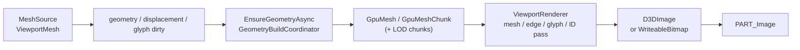

# WpfCustomUI.Viewport3D

Direct3D 11 ベースの **3D メッシュ／コンター ビューポート** です（Silk.NET）。

設計の詳細・フェーズ履歴の正本は [`.dev/spec.md`](../.dev/spec.md) の **§6.16〜6.24** です。本 README は構成地図に留めます。

## 役割

- `WcuViewport`: メッシュ表示、コンター、変形、断面、ピック、LOD、非同期ジオメトリ構築など
- `ViewportMesh` ほか、描画に渡すモデル／選択／注釈 API
- FEM 要素→三角形の抽出は **アプリ責務**。ライブラリは描画レベル（三角形・節点）を扱う

## 依存

| 種類 | 内容 |
| --- | --- |
| TFM | `net10.0-windows` |
| プロジェクト | `WpfCustomUI.Controls`（テーマトークン・`ColorScale` など） |
| パッケージ | `Silk.NET.Direct3D11` / `Direct3D9` / `DXGI` / `Direct3D.Compilers` |

## 利用の入り方

1. Controls の `WcuTheme` をアプリに入れる  
2. 本プロジェクトを参照し、`WcuViewport` + `ViewportMesh` をバインド  
3. Gallery の Viewport／Benchmark ページ、または CaeStudio の結果表示を参照

```xml
xmlns:ui="https://schemas.wpfcustomui.dev/xaml"
...
<ui:WcuViewport MeshSource="{Binding Meshes}"
                ColorScale="{Binding ContourScale}" />
```

## 層構成

| 層 | 置き場 | 責務 |
| --- | --- | --- |
| コントロール | `WcuViewport.cs` | DP／入力／オーバーレイ（注釈・ViewCube・トライアド）／構築キック／描画要求 |
| モデル API | `ViewportMesh`, `ViewportSelection`, `ViewportCamera`, `SectionPlane`, `ViewportAnnotation`, … | バインド可能な公開モデル。配列は **差し替え** で更新通知 |
| レンダリング | `Rendering/` | `ViewportRenderer`（デバイス・パス・Present）、`GpuMesh`／チャンク、HLSL、選択メッシュ |
| 支援ロジック | ルートの `Viewport*.cs` | 幾何・チャンク分割・LOD・カリング・ピック ID・変形・グリフ・断面数式など（多くは `internal`） |

`WcuViewport` が UI スレッドの司令塔で、重い GPU バッファ構築はバックグラウンド＋世代管理に逃がします。

## データの流れ



要点:

- **Positions / TriangleIndices / ScalarValues** 差し替え → ジオメトリ再構築（非同期可）
- **Displacements** 差し替え → 変位バッファの Map 更新のみ（フレーム再生向け）
- **VectorValues** 差し替え → グリフ インスタンスバッファ更新
- 構築中も旧 GPU メッシュで描画・操作を継続し、完了時にアトミック差し替え（世代が古い結果は破棄）

## 主要型

### 公開 API

| 型 | 説明 |
| --- | --- |
| `WcuViewport` | lookless `Control`。`MeshSource` / `ColorScale` / 選択・断面・変形・プローブ等の DP |
| `ViewportMesh` | 1 パーツ: 座標・三角形・スカラー・変位・ベクトル・色／可視／エッジ／クリップ対象 |
| `ViewportCamera` | ターンテーブル（Target + Yaw/Pitch/Distance）。透視／平行 |
| `ViewportSelection` | 面・節点・パーツ選択集合。ハイライト描画はビューポート内蔵 |
| `SectionPlane` | 断面（法線・点）。描画は GPU クリップ |
| `ViewportAnnotation` | 節点バインド注釈（WPF オーバーレイ） |
| `ProbeResult` / `ProbePickedEventArgs` | プローブヒット結果 |
| `ViewportHoverInfo` | ホバー中の三角形／節点／パーツ |
| `Bounds3D` | AABB |
| `ViewportProjection` / `ViewportPickMode` / `ViewportStandardView` 等 | 列挙 |

### 内部（触るとき用の地図）

| 型 | 説明 |
| --- | --- |
| `ViewportRenderer` | D3D デバイス、描画パス、D3DImage／WARP 経路、ID ピックパス |
| `GpuMesh` / `GpuMeshChunk` | チャンク分割 GPU バッファ、LOD、変位／グリフ更新 |
| `DeviceLease` | 非同期構築中もデバイスを AddRef で生かす |
| `GeometryBuildCoordinator` | 構築世代番号とキャンセル |

## 機能一覧と spec

| 機能 | 概要 | spec |
| --- | --- | --- |
| 基本表示 | メッシュ、コンター、エッジ、MSAA、テーマ連動背景 | [§6.16](../.dev/spec.md) |
| カメラ操作 | 回転／パン／ズーム／Fit、標準視点、ViewCube | §6.16 / [§6.17](../.dev/spec.md) |
| ピッキング／選択 | GPU ID パス、矩形選択、ハイライト | §6.17 |
| 変形表示 | GPU 頂点変位、スケール、位相スイープ連携 | [§6.18](../.dev/spec.md) |
| 断面 | `SectionPlane`、クリップ、インジケータ | [§6.19](../.dev/spec.md) |
| プローブ／注釈 | ヒット＋ラベル、書式は差し替え可 | [§6.20](../.dev/spec.md) |
| ベクトルグリフ | インスタンシング矢印、`VectorValues` | [§6.21](../.dev/spec.md) |
| 大規模メッシュ | チャンク、エッジ閾値、統計 | [§6.22](../.dev/spec.md) |
| LOD／カリング | 操作中 LOD、フラスタムカリング、圧縮法線 | [§6.23](../.dev/spec.md) |
| 非同期構築／ホバー／貫通 | 世代管理、ホバー、through-pick | [§6.24](../.dev/spec.md) |

## 実装上の注意

- **非同期構築は世代管理**: 構築中に再度 dirty になると古い結果は `Dispose` して捨てる（`GeometryBuildCoordinator`）。UI スレッドでだけ反映する。
- **デバイス寿命**: 構築中にレンダラーが破棄されてもよいよう `DeviceLease` でデバイスを AddRef して持ち出す。
- **Silk.NET `ComPtr`**: コンストラクタは AddRef する。`Dispose` は Handle を null にしない。生ポインタを `new ComPtr(ptr)` で包むと所有権が二重になりうる（変位更新は生ポインタで Map する）。
- **Present は二系統**: 通常は D3DImage（共有テクスチャ）。WARP／D3D9 不可時は WriteableBitmap へフォールバック。
- **配列更新は差し替え**: `ViewportMesh` の配列の中身を書き換えても検知されない（Charts の Series と同じ流儀）。

## テスト

[WpfCustomUI.Viewport3D.Tests](../WpfCustomUI.Viewport3D.Tests/) — 幾何・チャンク・LOD・カメラ不変性など。GPU 実機の UIA は Gallery／CaeStudio 側。

## 関連

- [WpfCustomUI.Controls](../WpfCustomUI.Controls/)
- [WpfCustomUI.Gallery](../WpfCustomUI.Gallery/)
- [samples/CaeStudio/CaeStudio.App](../samples/CaeStudio/CaeStudio.App/)
